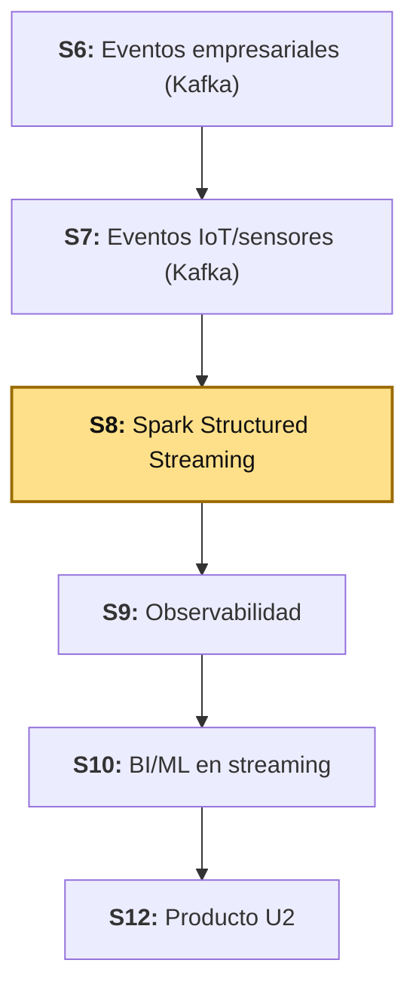
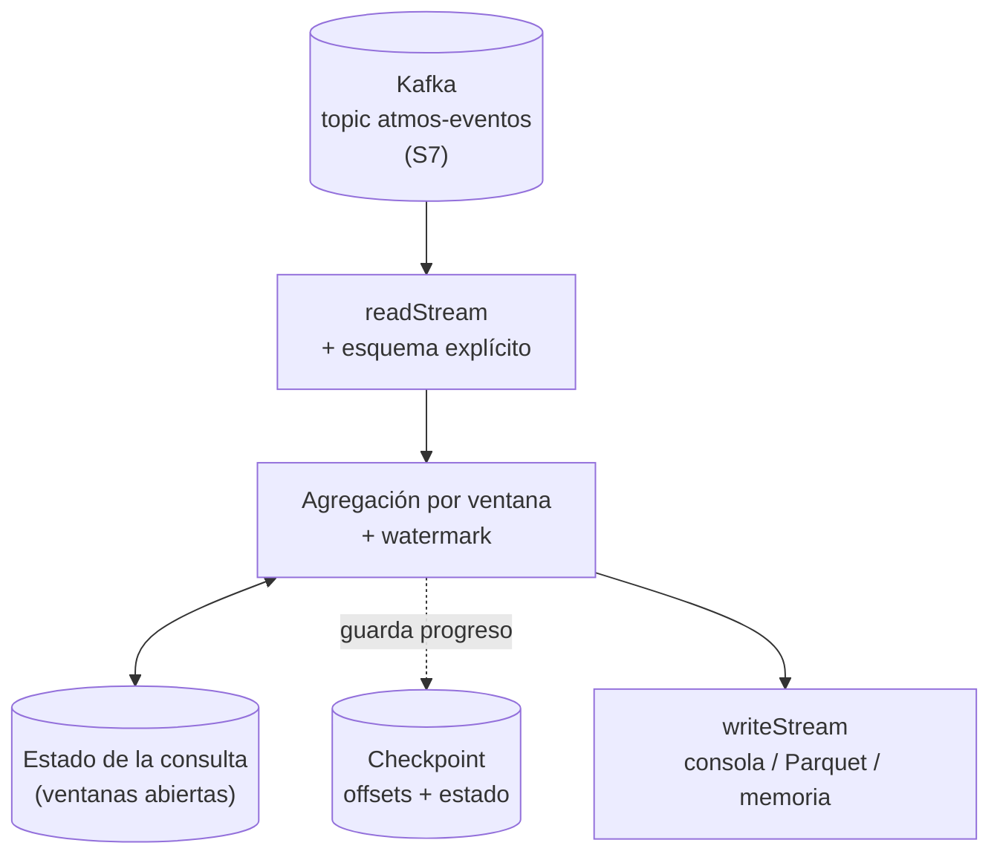
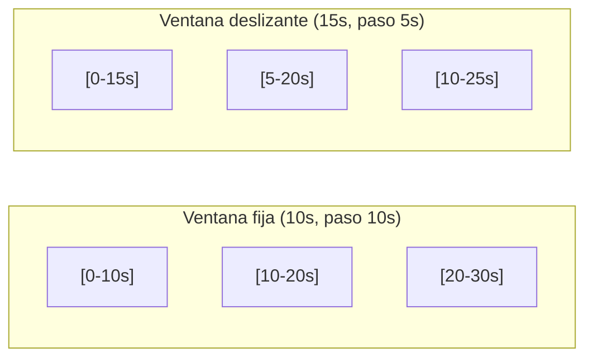

# S8 - Procesamiento en streaming con Spark: ventanas, watermarking y semántica de entrega

## 1. Introducción

Tiempo: 20 min.

### 1.1 Presentación de la sesión

S6 y S7 dejaron dos productores publicando en Kafka: eventos empresariales y telemetría de sensores. Hasta ahí, el consumidor de cada topic (`consumer_sensores.py`, en Python simple) procesa un mensaje a la vez y valida su forma y su rango. Esta sesión cambia de herramienta: **Spark Structured Streaming** lee el mismo topic `atmos-eventos` de S7, pero en vez de procesar mensaje por mensaje, agrupa los eventos en micro-lotes y permite **agregarlos por ventanas de tiempo** — un promedio de temperatura cada 10 segundos, por sensor. Esa idea trae dos preguntas nuevas que un consumidor simple no tenía que responder: ¿cuánto tiempo se espera a un dato que llega tarde?, y ¿qué pasa con el resultado si el proceso se cae a mitad de camino? El porqué de tratarlas juntas se desarrolla en 1.6, a partir del caso.

### 1.2 Índice

1. Streaming por micro-lotes: `readStream`, `writeStream` y modos de salida.
2. Ventanas de tiempo: fijas y deslizantes.
3. Watermarking: acotar la espera por datos tardíos.
4. Checkpointing: tolerancia a fallos en una consulta que no termina.
5. Semántica de entrega: al menos una vez, y cómo deduplicar.

### 1.3 Propósito de aprendizaje

Al concluir la clase, estarás en condiciones de:

- **Construir** un pipeline de Spark Structured Streaming que agrega eventos por ventanas de tiempo, aplicando watermarking para descartar datos tardíos y checkpointing para tolerar fallos, y **explicar**, con evidencia real, la semántica de entrega resultante y el efecto del intervalo de disparo sobre la latencia y el throughput.

### 1.4 Producto de sesión

Notebook `08_streaming_estructurado_practica.ipynb` corriendo sobre `atmos-eventos` (el mismo topic de S7): lectura en modo streaming con esquema explícito, agregación por ventana fija y por ventana deslizante, comparación con y sin watermarking, inspección del contenido real de un *checkpoint*, un evento tardío descartado por el watermark, deduplicación acotada de un evento repetido, comparación de dos intervalos de disparo, y una salida persistida en Parquet.

### 1.5 Metodología

**Tabla 1. Metodología de la sesión**

| Actividades a Realizar en el Periodo | Orientaciones generales (Orientaciones Metodológicas) | Material de estudio recomendado |
|---|---|---|
| Revisión previa individual | Confirmar que `kafka` y `uso-atmos` (S7) siguen arrancando, y que el productor de sensores (`producer_sensores.py`) publica en `atmos-eventos`. Repasar el contrato del evento `sensor.lectura` (S7, 3.6). Trabajo individual, antes de clase. | Guía de S7 (2.1, 3.6), este mismo documento (1.1-1.7). |
| Clase presencial | Construcción guiada del notebook `08-streaming-estructurado`: lectura streaming, ventanas, watermarking, checkpointing, deduplicación y comparación de intervalos de disparo, sobre datos reales llegando en vivo. Trabajo individual, siguiendo al docente paso a paso; consulta inmediata ante una consulta que no arranca o una ventana que no se cierra. | Pasos 3.1 a 3.13 de esta guía. |
| Evaluación formativa | Revisión en clase de la diferencia real entre la agregación sin watermark (creciendo sin límite) y con watermark (acotada), y de la evidencia de que un dato tardío se descarta. La evidencia se completa y sustenta de forma individual, fuera del aula, según los criterios mínimos de la sección 4.4. | Indicaciones de entrega (4.3), rúbrica de evaluación (4.6). |

### 1.6 Motivación de la sesión

#### 1.6.1 Caso: el cajero que nunca cerraba caja

Un supermercado registra cada venta en el momento en que ocurre. Al final del día, alguien debía sumar el total — pero el cajero nunca "cerraba" el día: seguía sumando ventas de ayer, de anteayer, de la semana pasada, todas juntas, para siempre. La planilla de sumas crecía sin parar, y a los pocos meses ya no cabía en ningún escritorio.

Un supermercado distinto sí cierra caja cada noche: las ventas de un día se suman, se archivan, y la planilla de hoy empieza vacía. Pero si un comprobante de ayer aparece recién hoy (un cliente que devolvió un ticket tarde), ¿se reabre la caja ya cerrada, o se rechaza?

Un sistema que agrega eventos por ventanas de tiempo enfrenta exactamente este par de decisiones: cuánto tiempo mantener una ventana "abierta" antes de cerrarla y liberar su memoria, y qué hacer con un dato que llega después de que su ventana ya cerró. Eso es lo que esta sesión construye y prueba con datos reales.

**Preguntas de análisis**

**Activación de conocimientos previos**

1. ¿Qué pasaría si un negocio nunca cerrara sus cuentas del día, y las fuera sumando todas juntas para siempre?
2. En S6/S7, ¿el consumidor de Kafka agrupaba los eventos por algún periodo de tiempo, o procesaba cada uno por separado?

**Comprensión de streaming, ventanas y watermarking**

1. Si un sistema agrega eventos por ventanas de 10 segundos y nunca las cierra, ¿qué le pasa a la memoria del proceso con el paso de las horas?
2. ¿Qué información necesita el sistema para decidir que ya es seguro cerrar una ventana y dejar de esperar datos para ella?

### 1.7 Ubicación en el curso

- Unidad: U2 - Sistema Big Data en tiempo real: ingesta, streaming, observabilidad y BI/ML.
- Producto del curso: Proyecto Sello: sistema Big Data distribuido end-to-end para procesamiento batch y streaming, analítica/ML, observabilidad y visualización BI para la toma de decisiones.
- Producto de unidad: pipeline en tiempo real con ingesta de eventos empresariales e IoT/sensores, procesamiento streaming con Spark, observabilidad/costos y salidas BI/ML distribuidas.
- Avance del producto en esta sesión: procesamiento streaming con Spark Structured Streaming sobre la telemetría de S7 — ventanas, watermarking y checkpointing, la pieza que S9 va a observar y S10-S11 van a alimentar con modelos.

**Figura 1. Roadmap del producto de la Unidad II**



## 2. Explica

Tiempo: 30 min.

### 2.1 Arquitectura de la sesión

**Figura 2. Del topic de Kafka al resultado agregado, con estado tolerante a fallos**



Lectura del diagrama: los eventos entran por la izquierda igual que en S6-S7, pero ahora una **agregación con estado** (`State`) se intercala entre la lectura y la salida — es lo que permite calcular un promedio por ventana sin volver a leer todo el historial en cada micro-lote. El *checkpoint* es la memoria externa de ese estado: si el proceso se cae, se reconstruye desde ahí. Cada apartado siguiente desarrolla una de estas piezas, en el mismo orden del Índice (1.2).

### 2.2 Streaming por micro-lotes: `readStream`, `writeStream` y modos de salida

Spark Structured Streaming no procesa un evento a la vez: agrupa los eventos que llegaron en un intervalo en un **micro-lote** (*micro-batch*) y lo procesa como si fuera una tabla — la misma API de DataFrame de S2-S4, aplicada a datos que nunca dejan de llegar. `spark.readStream` crea la fuente; `.writeStream` crea el destino (*sink*) y arranca la consulta.

**Tabla 2. `read`/`write` frente a `readStream`/`writeStream`**

| | Batch (S2-S4) | Streaming (hoy) |
|---|---|---|
| Cuándo termina | Cuando termina de procesar los datos que ya existen. | Nunca, salvo que se detenga a mano (`query.stop()`). |
| `.show()` / `.count()` | Funcionan directo. | No existen sobre el DataFrame streaming: hay que usar `.writeStream` con un *sink*. |
| Unidad de trabajo | Toda la tabla, de una vez. | Un micro-lote a la vez, cada `trigger`. |
| Progreso | No aplica. | Se guarda en el *checkpoint* (2.4). |

Un *sink* de salida exige declarar un **modo de salida**, porque no todos los resultados se pueden entregar de la misma forma:

**Tabla 3. Modos de salida (`outputMode`)**

| Modo | Qué entrega en cada micro-lote | Cuándo se usa |
|---|---|---|
| `append` | Solo las filas nuevas, que ya no van a cambiar. | Eventos sin agregar (3.4), o agregaciones con watermark cuya ventana ya cerró. |
| `update` | Las filas que cambiaron desde el último micro-lote. | Agregaciones con watermark, para ver el resultado actualizarse (3.6, 3.7). |
| `complete` | Toda la tabla de resultados, completa, en cada micro-lote. | Agregaciones sin watermark, o tablas pequeñas donde reimprimir todo es aceptable (3.5). |

`append` es el único modo que un *sink* de archivo (Parquet, JSON, CSV) acepta cuando hay una agregación de por medio: no puede "reescribir" una fila que ya guardó en disco.

### 2.3 Ventanas de tiempo: fijas y deslizantes

Una **ventana de tiempo** agrupa eventos según su **tiempo de evento** (cuándo ocurrió, un dato del propio evento) y no su **tiempo de procesamiento** (cuándo Spark lo vio) — la distinción importa porque un evento puede llegar tarde (2.4), y solo el tiempo de evento describe cuándo pasó de verdad en el mundo real.

**Tabla 4. Ventana fija frente a ventana deslizante**

| | Fija (*tumbling*) | Deslizante (*sliding*) |
|---|---|---|
| Relación ancho/paso | El paso es igual al ancho. | El paso es menor que el ancho. |
| Un evento cae en... | Exactamente una ventana. | Varias ventanas a la vez. |
| Costo de estado | Uno por ventana. | Un evento se cuenta en varias ventanas: más estado. |
| Para qué sirve | Un resumen por bloque de tiempo, sin solapar. | Suavizar una métrica, actualizándola más seguido de lo que dura la ventana. |

**Figura 3. Una ventana fija de 10s frente a una deslizante de 15s con paso de 5s**



En Spark, ambas se escriben con la misma función, `window(columna_de_tiempo, ancho)` para la fija, y `window(columna_de_tiempo, ancho, paso)` para la deslizante — el tercer argumento es la única diferencia de sintaxis (Apache Software Foundation, 2024).

### 2.4 Watermarking: acotar la espera por datos tardíos

Sin ninguna regla adicional, una agregación por ventana tendría que guardar el estado de **cada ventana que existió jamás**, por si acaso llega un evento tardío que todavía la necesite — el problema del cajero que nunca cierra caja (1.6.1). El **watermark** es esa regla: declara cuánto tiempo, como máximo, se va a esperar por un dato tardío, contado desde el evento más reciente visto.

> watermark(t) = max(tiempo de evento visto hasta ahora) − margen de tolerancia

Una ventana se cierra quando el watermark supera su límite superior. Un evento que llega **después** de que su ventana cerró se descarta, sin lanzar ningún error — es una decisión de diseño, no una falla (Apache Software Foundation, 2024).

**Tabla 5. Qué pasa según cuándo llega el evento**

| Situación | Resultado |
|---|---|
| El evento llega antes de que el watermark alcance su ventana. | Se agrega normalmente; la ventana se actualiza. |
| El evento llega después de que el watermark ya pasó su ventana. | Se descarta en silencio. |
| Es de los primeros eventos que ve la consulta (el watermark todavía no tiene ninguna referencia). | Se acepta, aunque su marca de tiempo sea vieja — el watermark recién se establece con el primer lote. |

Esa última fila es un caso de borde real, no teórico: se verifica con datos reales en 3.9.

### 2.5 Checkpointing: tolerancia a fallos en una consulta que no termina

Una consulta de streaming corre indefinidamente, así que tarde o temprano se va a caer o se va a reiniciar — por una actualización, un error, un reinicio del servidor. El **checkpoint** es la carpeta donde Spark guarda, en cada micro-lote, todo lo necesario para retomar exactamente donde se quedó: qué *offset* de cada partición de Kafka ya se leyó, y el contenido de cada ventana todavía abierta.

**Tabla 6. Contenido de un checkpoint**

| Carpeta | Qué guarda |
|---|---|
| `offsets/` | El *offset* de Kafka hasta el que se leyó, por cada micro-lote. |
| `commits/` | Qué micro-lotes terminaron de escribirse por completo. |
| `state/` | El contenido de cada ventana (u otro estado) que la agregación todavía tiene abierto. |

Sin un `checkpointLocation`, una consulta con agregación (con estado) ni siquiera arranca — Spark no tiene dónde guardar ese progreso. Reiniciar una consulta apuntando al mismo *checkpoint* la hace retomar desde el último *offset* confirmado, sin reprocesar el topic entero desde el principio (Apache Software Foundation, 2024).

### 2.6 Semántica de entrega y el costo del intervalo de disparo

Kafka entrega cada mensaje **al menos una vez** (*at-least-once*, S6-S7): nunca se pierde un mensaje, pero un reintento tras un fallo de red puede duplicarlo. Structured Streaming no cambia esa garantía de origen: lo que puede hacer es evitar que un duplicado se **cuente** dos veces, con `dropDuplicates` acotado por un watermark — la misma idea de 2.4, aplicada al contenido del evento en vez de a la ventana.

**Tabla 7. Semántica de entrega**

| Garantía | Qué significa | Cómo se logra aquí |
|---|---|---|
| *At-most-once* | Un mensaje se procesa cero o una vez; puede perderse. | No es el caso de Kafka. |
| *At-least-once* | Un mensaje se procesa una o más veces; nunca se pierde. | Lo que da Kafka por defecto. |
| *Effectively-once* (o "exactamente una vez" en la práctica) | El resultado final es como si cada mensaje se hubiera procesado una sola vez. | `dropDuplicates` con un identificador del evento, acotado por watermark. |

El **intervalo de disparo** (`trigger`) decide cada cuánto se arma un micro-lote, y con eso reparte el compromiso entre **latencia** (cuánto espera un evento antes de aparecer en el resultado) y **throughput** (cuántos eventos se procesan juntos, con menos *overhead* por lote). Un disparo más frecuente baja la latencia y sube el *overhead*; uno menos frecuente hace lo contrario. Ninguno es "el correcto": depende de si el sistema necesita reaccionar rápido o procesar volumen (Databricks, 2024).

## 3. Aplica: actividad práctica guiada

Tiempo: 3h.

**Actividad:** construir el notebook `08_streaming_estructurado_practica.ipynb` sobre el entorno `lambda26` (`uso-pyspark`), consumiendo en modo streaming el mismo topic `atmos-eventos` de S7, aplicando ventanas de tiempo, watermarking, checkpointing, deduplicación y comparación de intervalos de disparo, con datos reales llegando en vivo.

**Propósito de la actividad:** dejar evidencia ejecutable de que dominas la diferencia entre batch y streaming, el efecto real del watermarking sobre el estado y sobre los datos tardíos, qué guarda un *checkpoint*, y cómo el intervalo de disparo cambia la latencia y el throughput — antes de confiar en un pipeline de streaming sin haber visto fallar, a propósito, cada una de esas piezas.

**Orientaciones metodológicas:** en clase, el docente guía la construcción del notebook paso a paso, alternando explicación breve y ejecución; los estudiantes replican cada celda en su propio entorno, con el productor de sensores de S7 corriendo en vivo — varios pasos de hoy solo se entienden viendo llegar datos reales, no un dataset estático.

**Actividades para realizar:**

- **3.1** Reanudar el entorno `lambda26` y verificar el punto de partida.
- **3.2** Leer el topic en modo streaming.
- **3.3** Parsear el JSON con un esquema explícito.
- **3.4** Primera consulta: ver los eventos llegar.
- **3.5** Agregar por ventana de tiempo, sin límite (el problema que resuelve 3.6).
- **3.6** Watermarking: acotar cuánto se espera por datos tardíos.
- **3.7** Ventana deslizante: una lectura que se actualiza más seguido que se cierra.
- **3.8** Checkpointing: qué guarda, y qué pasa al reiniciar.
- **3.9** Un dato tardío, y el watermark descartándolo.
- **3.10** Deduplicación acotada por watermark.
- **3.11** Intervalo de disparo: el costo de decidir cada cuánto procesar.
- **3.12** Escribir la salida a Parquet, con checkpoint.
- **3.13** Documentar hallazgos y responder preguntas de reflexión.

### 3.1 Reanudar el entorno `lambda26` y verificar el punto de partida

**Producto del paso:** Kafka, Kafka UI y el simulador de sensores de S7 (`uso-atmos`) corriendo, con eventos reales llegando a `atmos-eventos`.

Este notebook **no genera sus propios datos**: consume el mismo topic que S7 ya construyó. Antes de continuar, en una terminal (fuera del notebook):

```bash
cd kafka && docker compose up -d
cd ../uso-atmos && docker compose up -d
docker exec -d lambda26-uso-atmos python /app/producer_sensores.py
```

Deja el productor corriendo durante toda la sesión: varias celdas de este notebook necesitan eventos **llegando en vivo**, no solo los que ya están en el topic.

**Error frecuente**: el productor se detiene solo si el contenedor `uso-atmos` se recrea (por ejemplo, al bajar y volver a levantar el stack) — `docker exec -d` no sobrevive a que el contenedor se reinicie. Antes de correr una celda que depende de datos en vivo, confirma que el proceso sigue vivo (`docker exec lambda26-uso-atmos ps aux`, o revisa Kafka UI: el *lag* del topic debe estar creciendo).

### 3.2 Crear el notebook y la `SparkSession`, con el conector de Kafka

**Producto del paso:** notebook `08_streaming_estructurado_practica.ipynb` con una `SparkSession` capaz de leer y escribir Kafka.

```python
from pyspark.sql import SparkSession

spark = (
    SparkSession.builder
    .appName("sesion8-streaming-estructurado")
    .master("local[*]")
    .config("spark.jars.packages", "org.apache.spark:spark-sql-kafka-0-10_2.13:4.2.0")
    .config("spark.sql.shuffle.partitions", "3")
    .config("spark.ui.port", "4040")
    .getOrCreate()
)
spark.sparkContext.setLogLevel("ERROR")
spark
```

`spark.jars.packages` agrega el conector `spark-sql-kafka-0-10`, que Spark no trae por defecto (a diferencia de la lectura de CSV o Parquet de S2-S4). La primera vez que se ejecuta esta celda, Spark descarga el conector y sus dependencias desde Maven Central — puede tardar. `spark.sql.shuffle.partitions` se baja a 3 (el número de particiones del topic, S7): con el valor por defecto (200), cada micro-lote crearía 200 tareas para casi ningún dato.

Verifica que el topic tiene mensajes, con una lectura **batch** (no streaming) — el mismo tipo de lectura que ya usaste con CSV o Parquet, aplicada a Kafka:

```python
lote = (
    spark.read.format("kafka")
    .option("kafka.bootstrap.servers", "kafka:9092")
    .option("subscribe", "atmos-eventos")
    .option("startingOffsets", "earliest")
    .load()
)
print("mensajes en el topic:", lote.count())
lote.selectExpr("CAST(key AS STRING) AS key", "CAST(value AS STRING) AS value", "partition", "offset").orderBy("offset", ascending=False).show(3, truncate=False)
```

Resultado real de esta corrida:

```text
mensajes en el topic: 446

+-----------------+--------------------------------------------------------------+---------+------+
|key              |value                                                          |partition|offset|
+-----------------+--------------------------------------------------------------+---------+------+
|esp32-invernadero|{"tipoEvento": "sensor.lectura", "sensorId": "esp32-invernadero...|2        |457   |
|esp32-patio      |{"tipoEvento": "sensor.lectura", "sensorId": "esp32-patio", "te...|2        |456   |
|esp32-invernadero|{"tipoEvento": "sensor.lectura", "sensorId": "esp32-invernadero...|2        |455   |
+-----------------+--------------------------------------------------------------+---------+------+
```

Un numero mayor que cero, y JSON con `sensorId`, `temperatura`, `humedad`, `presion` (el contrato de S7). Una lectura **batch** de Kafka lee lo que hay **hoy** y termina; el resto del notebook usa lectura **streaming**, que no termina — sigue escuchando.

### 3.3 Leer el topic en modo streaming

**Producto del paso:** un DataFrame que **no se puede materializar con `.show()` ni `.count()`** — la primera diferencia real entre batch y streaming.

```python
crudo = (
    spark.readStream.format("kafka")
    .option("kafka.bootstrap.servers", "kafka:9092")
    .option("subscribe", "atmos-eventos")
    .option("startingOffsets", "latest")
    .load()
)
print("es un stream:", crudo.isStreaming)
crudo.printSchema()
```

Resultado real:

```text
es un stream: True
root
 |-- key: binary (nullable = true)
 |-- value: binary (nullable = true)
 |-- topic: string (nullable = true)
 |-- partition: integer (nullable = true)
 |-- offset: long (nullable = true)
 |-- timestamp: timestamp (nullable = true)
 |-- timestampType: integer (nullable = true)
```

`readStream` en vez de `read` es la única diferencia de sintaxis, y cambia todo lo que viene después: `crudo` es un **plan**, no una tabla en memoria. `crudo.show()` fallaría con `AnalysisException`, porque mostrar implica materializar de una vez, y un stream no tiene un "final" que mostrar. Cada mensaje de Kafka llega con las mismas columnas, sin importar el topic: `key`, `value` (ambos en binario), `topic`, `partition`, `offset`, `timestamp`. El contenido real del evento está **adentro** de `value`, sin parsear todavía — eso es 3.4.

`startingOffsets: "latest"` (no `"earliest"`) es a propósito: en un stream que corre indefinidamente, no tiene sentido reprocesar todo el historial cada vez que se reinicia una consulta de prueba — se quiere ver lo que llega **de ahora en adelante**. La diferencia importa, y se vuelve a ver en 3.9.

### 3.4 Parsear el JSON con un esquema explícito

**Producto del paso:** las columnas reales del evento (`sensorId`, `temperatura`...), ya tipadas, listas para agregar.

```python
from pyspark.sql.functions import from_json, col
from pyspark.sql.types import StructType, StringType, DoubleType, LongType

esquema_evento = (
    StructType()
    .add("tipoEvento", StringType())
    .add("sensorId", StringType())
    .add("temperatura", DoubleType())
    .add("humedad", DoubleType())
    .add("presion", DoubleType())
    .add("origen", StringType())
    .add("timestamp", LongType())
)

eventos = (
    crudo.selectExpr("CAST(value AS STRING) AS json_str")
    .select(from_json(col("json_str"), esquema_evento).alias("e"))
    .select("e.*")
    .withColumn("ts", (col("timestamp") / 1000).cast("timestamp"))
)
eventos.printSchema()
```

Resultado real:

```text
root
 |-- tipoEvento: string (nullable = true)
 |-- sensorId: string (nullable = true)
 |-- temperatura: double (nullable = true)
 |-- humedad: double (nullable = true)
 |-- presion: double (nullable = true)
 |-- origen: string (nullable = true)
 |-- timestamp: long (nullable = true)
 |-- ts: timestamp (nullable = true)
```

`value` llega en binario; `CAST(value AS STRING)` lo vuelve texto, y `from_json` lo convierte a columnas según `esquema_evento` — el mismo contrato de `sensor.lectura` que S7 documentó. Un esquema **explícito** (no inferido) es obligatorio en streaming: Spark no puede "mirar" todo el stream para adivinar tipos, porque el stream no tiene fin. `ts` convierte el `timestamp` (milisegundos *epoch*, un `Long`) a un tipo `timestamp` real: **es la columna que 3.5 en adelante usa como reloj del evento** — el momento en que el sensor midió, no el momento en que Spark lo procesa.

### 3.5 Primera consulta: ver los eventos llegar

**Producto del paso:** la primera consulta de streaming corriendo, con salida por consola.

```python
consulta = (
    eventos.writeStream
    .outputMode("append")
    .format("console")
    .option("truncate", "false")
    .trigger(processingTime="5 seconds")
    .start()
)
consulta.awaitTermination(20)
consulta.stop()
```

Resultado real (dos de los micro-lotes):

```text
-------------------------------------------
Batch: 1
-------------------------------------------
+--------------+-----------------+-----------+-------+-------+---------+-------------+-----------------------+
|tipoEvento    |sensorId         |temperatura|humedad|presion|origen   |timestamp    |ts                     |
+--------------+-----------------+-----------+-------+-------+---------+-------------+-----------------------+
|sensor.lectura|esp32-laboratorio|9.6        |35.9   |1017.8 |uso-atmos|1790512778045|2026-09-27 12:39:38.045|
|sensor.lectura|esp32-patio      |12.0       |87.7   |1001.3 |uso-atmos|1790512778035|2026-09-27 12:39:38.035|
|sensor.lectura|esp32-invernadero|40.0       |60.9   |1003.0 |uso-atmos|1790512778041|2026-09-27 12:39:38.041|
+--------------+-----------------+-----------+-------+-------+---------+-------------+-----------------------+
```

`writeStream` (no `write`) inicia una **consulta continua**: `.start()` la lanza en segundo plano y devuelve de inmediato un objeto `StreamingQuery`; el proceso sigue corriendo aunque la celda ya haya terminado. `awaitTermination(20)` bloquea esta celda 20 segundos para que se alcance a ver algo, y `.stop()` la detiene a mano — en un sistema real, una consulta de streaming no se detiene sola, corre para siempre.

`outputMode("append")` dice que solo se muestran filas **nuevas**, nunca modificadas — es el único modo válido para eventos sin agregar, como estos. `trigger(processingTime="5 seconds")` fija cada cuánto se arma un micro-lote: Structured Streaming no procesa evento por evento, sino en **micro-lotes** cada 5 segundos.

**Error frecuente**: al llamar `.stop()`, el log muestra líneas `ERROR ... Aborting task` o `TaskKilledException`. No es una falla: es Spark cancelando, a mitad de camino, las tareas del micro-lote que estaba en curso cuando se pidió detener la consulta. Es ruido esperado de un `stop()` abrupto, no un error del notebook — mientras la celda no lance una excepción de Python, la consulta terminó bien.

### 3.6 Agregar por ventana de tiempo, sin límite (el problema que resuelve 3.7)

**Producto del paso:** evidencia de que, sin watermark, el estado de una agregación por ventana **crece para siempre**.

```python
from pyspark.sql.functions import window, avg, count

agregado_sin_limite = (
    eventos.groupBy(window(col("ts"), "10 seconds"), col("sensorId"))
    .agg(avg("temperatura").alias("temp_prom"), count("*").alias("n"))
)

consulta = (
    agregado_sin_limite.writeStream
    .outputMode("complete")
    .format("console")
    .option("truncate", "false")
    .trigger(processingTime="5 seconds")
    .start()
)
consulta.awaitTermination(25)
consulta.stop()
```

Resultado real, dos micro-lotes consecutivos (nota cómo la ventana `12:39:50-12:40:00` se repite, igual, en ambos):

```text
-------------------------------------------
Batch: 3
-------------------------------------------
+------------------------------------------+-----------------+------------------+---+
|window                                    |sensorId         |temp_prom         |n  |
+------------------------------------------+-----------------+------------------+---+
|{2026-09-27 12:40:00, 2026-09-27 12:40:10}|esp32-laboratorio|9.333333333333334 |3  |
|{2026-09-27 12:40:00, 2026-09-27 12:40:10}|esp32-patio      |11.733333333333334|3  |
|{2026-09-27 12:40:00, 2026-09-27 12:40:10}|esp32-invernadero|39.6              |3  |
|{2026-09-27 12:39:50, 2026-09-27 12:40:00}|esp32-patio      |11.8              |2  |
|{2026-09-27 12:39:50, 2026-09-27 12:40:00}|esp32-laboratorio|9.25              |2  |
|{2026-09-27 12:39:50, 2026-09-27 12:40:00}|esp32-invernadero|39.650000000000006|2  |
+------------------------------------------+-----------------+------------------+---+

-------------------------------------------
Batch: 4
-------------------------------------------
+------------------------------------------+-----------------+------------------+---+
|window                                    |sensorId         |temp_prom         |n  |
+------------------------------------------+-----------------+------------------+---+
|{2026-09-27 12:40:00, 2026-09-27 12:40:10}|esp32-laboratorio|9.333333333333334 |3  |
|{2026-09-27 12:40:00, 2026-09-27 12:40:10}|esp32-patio      |11.733333333333334|3  |
|{2026-09-27 12:40:00, 2026-09-27 12:40:10}|esp32-invernadero|39.6              |3  |
|{2026-09-27 12:40:10, 2026-09-27 12:40:20}|esp32-invernadero|39.7              |2  |
|{2026-09-27 12:40:10, 2026-09-27 12:40:20}|esp32-laboratorio|9.45              |2  |
|{2026-09-27 12:39:50, 2026-09-27 12:40:00}|esp32-patio      |11.8              |2  |
|{2026-09-27 12:39:50, 2026-09-27 12:40:00}|esp32-laboratorio|9.25              |2  |
|{2026-09-27 12:40:10, 2026-09-27 12:40:20}|esp32-patio      |11.4              |2  |
|{2026-09-27 12:39:50, 2026-09-27 12:40:00}|esp32-invernadero|39.650000000000006|2  |
+------------------------------------------+-----------------+------------------+---+
```

`window(col("ts"), "10 seconds")` agrupa los eventos en bloques de 10 segundos de tiempo de **evento** (`ts`), no de tiempo de procesamiento — dos sensores que midieron en el mismo instante caen en la misma ventana, sin importar cuándo Spark los procesó. `outputMode("complete")` es el único modo que puede acompañar a una agregación **sin** watermark: en cada micro-lote, Spark reimprime **todas** las ventanas vistas hasta ahora, porque no tiene ninguna señal de que una ventana vieja ya no va a recibir más datos.

La tabla completa **crece** de un micro-lote al siguiente: la ventana `12:39:50-12:40:00` sigue apareciendo, igual, en el Batch 4, junto a las dos ventanas nuevas. Ese es el problema: Spark tiene que guardar el estado de **cada ventana que existió jamás**, indefinidamente — en un sistema real, que corre por días, esto agota la memoria. El watermarking (3.7) es la respuesta.

### 3.7 Watermarking: acotar cuánto se espera por datos tardíos

**Producto del paso:** la misma agregación, pero con las ventanas viejas **cerradas y liberadas** de la memoria.

```python
agregado_con_watermark = (
    eventos
    .withWatermark("ts", "10 seconds")
    .groupBy(window(col("ts"), "10 seconds"), col("sensorId"))
    .agg(avg("temperatura").alias("temp_prom"), count("*").alias("n"))
)

consulta = (
    agregado_con_watermark.writeStream
    .outputMode("update")
    .format("console")
    .option("truncate", "false")
    .option("checkpointLocation", "/tmp/s08-chk-watermark")
    .trigger(processingTime="5 seconds")
    .start()
)
consulta.awaitTermination(25)
consulta.stop()
```

Resultado real, dos micro-lotes consecutivos — compáralos con los de 3.6: aquí **no** se repite la ventana anterior en cada lote, solo la que cambió:

```text
-------------------------------------------
Batch: 1
-------------------------------------------
+------------------------------------------+-----------------+---------+---+
|window                                    |sensorId         |temp_prom|n  |
+------------------------------------------+-----------------+---------+---+
|{2026-09-27 12:40:20, 2026-09-27 12:40:30}|esp32-laboratorio|9.3      |1  |
|{2026-09-27 12:40:20, 2026-09-27 12:40:30}|esp32-patio      |10.9     |1  |
|{2026-09-27 12:40:20, 2026-09-27 12:40:30}|esp32-invernadero|39.4     |1  |
+------------------------------------------+-----------------+---------+---+

-------------------------------------------
Batch: 2
-------------------------------------------
+------------------------------------------+-----------------+------------------+---+
|window                                    |sensorId         |temp_prom         |n  |
+------------------------------------------+-----------------+------------------+---+
|{2026-09-27 12:40:20, 2026-09-27 12:40:30}|esp32-laboratorio|9.266666666666667 |3  |
|{2026-09-27 12:40:20, 2026-09-27 12:40:30}|esp32-patio      |11.133333333333333|3  |
|{2026-09-27 12:40:20, 2026-09-27 12:40:30}|esp32-invernadero|39.199999999999996|3  |
+------------------------------------------+-----------------+------------------+---+
```

`withWatermark("ts", "10 seconds")` es la regla que le faltaba a 3.6: le dice a Spark "una vez que veas un evento con `ts` = X, ya no esperes datos con `ts` anterior a X menos 10 segundos — cierra esas ventanas y olvídalas". El **watermark** en un momento dado es, entonces, el evento más reciente visto menos ese margen. Con el watermark, `outputMode("update")` ya es válido: en cada micro-lote solo se imprimen las ventanas que **cambiaron**, no todas — y las ventanas cerradas dejan de aparecer y dejan de ocupar memoria.

`checkpointLocation` aparece por primera vez: es la carpeta donde Spark guarda el estado de la consulta (qué ventanas existen, hasta qué *offset* de Kafka se leyó). Sin ella, esta consulta con estado (una agregación) ni siquiera arrancaría. Se profundiza en 3.9.

### 3.8 Ventana deslizante: una lectura que se actualiza más seguido que se cierra

**Producto del paso:** ventanas que se **solapan**, para suavizar una métrica sin esperar a que cada bloque termine.

```python
agregado_deslizante = (
    eventos
    .withWatermark("ts", "15 seconds")
    .groupBy(window(col("ts"), "15 seconds", "5 seconds"), col("sensorId"))
    .agg(avg("temperatura").alias("temp_prom"), count("*").alias("n"))
)

consulta = (
    agregado_deslizante.writeStream
    .outputMode("update")
    .format("console")
    .option("truncate", "false")
    .option("checkpointLocation", "/tmp/s08-chk-deslizante")
    .trigger(processingTime="5 seconds")
    .start()
)
consulta.awaitTermination(25)
consulta.stop()
```

Resultado real — un solo evento de `esp32-laboratorio` (o de `esp32-patio`, `esp32-invernadero`) aparece en **tres** ventanas de 15 segundos distintas, que se solapan cada 5 segundos:

```text
-------------------------------------------
Batch: 1
-------------------------------------------
+------------------------------------------+-----------------+---------+---+
|window                                    |sensorId         |temp_prom|n  |
+------------------------------------------+-----------------+---------+---+
|{2026-09-27 12:40:40, 2026-09-27 12:40:55}|esp32-laboratorio|8.9      |1  |
|{2026-09-27 12:40:35, 2026-09-27 12:40:50}|esp32-patio      |11.4     |1  |
|{2026-09-27 12:40:40, 2026-09-27 12:40:55}|esp32-invernadero|39.4     |1  |
|{2026-09-27 12:40:35, 2026-09-27 12:40:50}|esp32-invernadero|39.4     |1  |
|{2026-09-27 12:40:35, 2026-09-27 12:40:50}|esp32-laboratorio|8.9      |1  |
|{2026-09-27 12:40:45, 2026-09-27 12:41:00}|esp32-invernadero|39.4     |1  |
|{2026-09-27 12:40:45, 2026-09-27 12:41:00}|esp32-laboratorio|8.9      |1  |
|{2026-09-27 12:40:45, 2026-09-27 12:41:00}|esp32-patio      |11.4     |1  |
|{2026-09-27 12:40:40, 2026-09-27 12:40:55}|esp32-patio      |11.4     |1  |
+------------------------------------------+-----------------+---------+---+
```

`window(col("ts"), "15 seconds", "5 seconds")` tiene un tercer argumento que 3.7 no tenía: el **paso** (5 segundos) es menor que el **ancho** (15 segundos) de la ventana. El resultado es una ventana **deslizante**: cada evento cae en **varias** ventanas de 15 segundos a la vez (una que empieza ahora, otra que empezó hace 5 segundos, otra hace 10). En 3.7, cada evento caía en **una sola** ventana (ventana **fija** o *tumbling*: el paso es igual al ancho).

Para un mismo `sensorId`, aparecen varias filas con rangos de `window` que se superponen — y el mismo evento cuenta para varias de ellas. Sirve para suavizar una lectura (un promedio que no salta de golpe cada 15 segundos), a costa de guardar más estado: cada evento se cuenta varias veces en la memoria de la consulta, no una.

### 3.9 Checkpointing: qué guarda, y qué pasa al reiniciar

**Producto del paso:** evidencia de que el *checkpoint* no es una carpeta vacía — ahí vive el progreso real de la consulta.

```python
import os

for carpeta in sorted(os.listdir("/tmp/s08-chk-watermark")):
    print(carpeta)
```

Resultado real:

```text
.metadata.crc
commits
metadata
offsets
sources
state
```

```python
archivos_offsets = sorted(os.listdir("/tmp/s08-chk-watermark/offsets"))
ultimo_offset = archivos_offsets[-1]
with open(f"/tmp/s08-chk-watermark/offsets/{ultimo_offset}") as f:
    print(f.read())
```

Resultado real (recortado):

```text
v1
{"batchWatermarkMs":1790512828406,"batchTimestampMs":1790512845013,"conf":{...}}
{"atmos-eventos":{"0":183,"1":3,"2":506}}
```

`offsets/` guarda, por cada micro-lote, hasta qué *offset* de cada partición de Kafka se leyó — en esta corrida, la partición 0 llegó hasta el mensaje 183, la 1 hasta el 3, la 2 hasta el 506. `commits/` confirma cuáles de esos micro-lotes terminaron de escribirse por completo. `state/` guarda el contenido de cada ventana abierta — es lo que 3.6 mostró creciendo sin límite.

La consecuencia práctica: si una consulta se cae y se reinicia **apuntando al mismo `checkpointLocation`**, Spark lee `offsets/` y retoma exactamente donde se quedó — no vuelve a leer el topic desde el principio, y no pierde el estado de las ventanas que ya tenía abiertas. Es la misma idea del *offset* de un `consumer group` de Kafka (S6, S7), pero aplicada también al estado de la agregación, no solo a la posición de lectura.

### 3.10 Un dato tardío, y el watermark descartándolo

**Producto del paso:** un evento con marca de tiempo vieja, publicado **después** de que el watermark ya avanzó más allá de su ventana — y la prueba de que Spark lo descarta sin avisar.

**Advertencia sobre el "arranque en frío":** si publicas el evento tardío como el **primer** mensaje que la consulta ve, no se descarta — el watermark todavía no tiene ningún evento "reciente" contra el cual compararlo (2.4, Tabla 5, última fila). Por eso, primero se deja correr la consulta con datos en vivo un rato, y **recién después** se publica el evento tardío.

```python
import threading
import time
import json
from pyspark.sql.functions import to_json, struct

def publicar_evento_tardio(segundos_de_espera, segundos_en_el_pasado):
    time.sleep(segundos_de_espera)
    ahora_ms = int(time.time() * 1000)
    evento_tardio = [(
        "sensor.lectura", "esp32-tardio", 99.9, 50.0, 1000.0,
        "prueba-watermark", ahora_ms - segundos_en_el_pasado * 1000
    )]
    columnas = ["tipoEvento", "sensorId", "temperatura", "humedad", "presion", "origen", "timestamp"]
    df_tardio = spark.createDataFrame(evento_tardio, columnas)
    salida = df_tardio.select(
        df_tardio.sensorId.cast("string").alias("key"),
        to_json(struct(*columnas)).alias("value"),
    )
    (salida.write.format("kafka")
        .option("kafka.bootstrap.servers", "kafka:9092")
        .option("topic", "atmos-eventos")
        .save())
    print(f">>> publicado esp32-tardio, {segundos_en_el_pasado}s en el pasado")

hilo = threading.Thread(target=publicar_evento_tardio, args=(15, 45), daemon=True)
hilo.start()

agregado = (
    eventos
    .withWatermark("ts", "5 seconds")
    .groupBy(window(col("ts"), "10 seconds"), col("sensorId"))
    .agg(count("*").alias("n"))
)

consulta = (
    agregado.writeStream
    .outputMode("update")
    .format("console")
    .option("truncate", "false")
    .option("checkpointLocation", "/tmp/s08-chk-tardio")
    .trigger(processingTime="4 seconds")
    .start()
)
consulta.awaitTermination(45)
consulta.stop()
print("Buscando 'esp32-tardio' en la salida de arriba: si no aparece ninguna fila, el watermark lo descarto.")
```

Resultado real: el hilo publicó `>>> publicado esp32-tardio, 45s en el pasado`, y en los **11 micro-lotes** que corrieron después de esa publicación, la cadena `esp32-tardio` **no apareció en ninguno**. El watermark de 5 segundos ya había avanzado más allá de la ventana a la que ese evento pertenecía, y Spark lo descartó en silencio.

El hilo publica un evento `esp32-tardio` cuyo `timestamp` corresponde a **45 segundos antes** del momento de publicación, pero recién 15 segundos después de arrancar la consulta — tiempo suficiente para que el watermark ya haya avanzado con los eventos en vivo del productor de S7. Con un watermark de 5 segundos, cualquier ventana que termine más de 5 segundos antes del evento más reciente visto queda cerrada, y un evento que llega después para esa ventana se descarta **en silencio**: no hay excepción, no hay log de error, la fila simplemente nunca aparece en la salida.

Esto se verificó dos veces antes de escribir esta guía: publicando el evento tardío **antes** de que el watermark avanzara (como primer mensaje de la consulta), sí se dejaba pasar — es el caso de "arranque en frío" de la advertencia de arriba. La lección no es "Spark falla a veces": es que el watermark necesita **datos frescos previos** para tener algo contra qué comparar.

### 3.11 Deduplicación acotada por watermark

**Producto del paso:** el mismo evento, publicado dos veces por error, contado **una sola vez**.

```python
deduplicado = (
    eventos
    .withWatermark("ts", "30 seconds")
    .dropDuplicates(["sensorId", "timestamp"])
)

consulta = (
    deduplicado.writeStream
    .outputMode("append")
    .format("console")
    .option("truncate", "false")
    .option("checkpointLocation", "/tmp/s08-chk-dedup")
    .trigger(processingTime="3 seconds")
    .start()
)

time.sleep(6)
columnas = ["tipoEvento", "sensorId", "temperatura", "humedad", "presion", "origen", "timestamp"]
evento_duplicado = spark.createDataFrame(
    [("sensor.lectura", "esp32-duplicado", 55.0, 55.0, 1000.0, "prueba-dedup", int(time.time() * 1000))],
    columnas,
)
salida = evento_duplicado.select(
    evento_duplicado.sensorId.cast("string").alias("key"),
    to_json(struct(*columnas)).alias("value"),
)
for intento in range(2):
    (salida.write.format("kafka")
        .option("kafka.bootstrap.servers", "kafka:9092")
        .option("topic", "atmos-eventos")
        .save())
print(">>> 'esp32-duplicado' publicado DOS veces")

consulta.awaitTermination(20)
consulta.stop()
print("Busca 'esp32-duplicado' arriba: debe aparecer una sola vez, aunque se publico dos veces.")
```

Resultado real: `esp32-duplicado` se publicó **dos veces** hacia el mismo topic, y apareció **una sola vez** en la salida deduplicada:

```text
|sensor.lectura|esp32-duplicado  |55.0       |55.0   |1000.0 |prueba-dedup|1790512922488|2026-09-27 12:42:02.488|
```

`dropDuplicates(["sensorId", "timestamp"])` descarta cualquier evento cuya combinación de esas dos columnas ya se vio antes. Sin `withWatermark`, esta operación tendría que recordar **todos** los eventos vistos jamás, para siempre — el mismo problema sin límite de 3.6, pero sobre los propios datos en vez de sobre ventanas. El watermark acota cuánto se recuerda: pasado el margen (30 segundos), un identificador viejo se olvida, y un duplicado *muy* tardío ya no se detectaría — es el mismo balance de siempre entre memoria y exactitud.

Esto responde directamente al porqué de **semántica de entrega** (2.6): Kafka entrega cada mensaje **al menos una vez** — nunca menos, a veces más, por reintentos ante fallos de red. `dropDuplicates` acotado por watermark es la pieza que convierte ese "al menos una vez" en un resultado que se comporta como "exactamente una vez", **sin** que el productor tenga que garantizar nada.

### 3.12 Intervalo de disparo: el costo de decidir cada cuánto procesar

**Producto del paso:** el mismo stream, con dos ritmos de disparo distintos, y la diferencia real en cuántos micro-lotes se alcanzan a correr.

```python
def contar_microlotes(intervalo, segundos_totales):
    consulta = (
        eventos.writeStream
        .outputMode("append")
        .format("memory")
        .queryName(f"conteo_{intervalo.replace(' ', '_')}")
        .trigger(processingTime=intervalo)
        .start()
    )
    consulta.awaitTermination(segundos_totales)
    consulta.stop()
    return consulta.lastProgress["batchId"] if consulta.lastProgress else None

ultimo_lote_rapido = contar_microlotes("1 second", 15)
ultimo_lote_lento = contar_microlotes("6 seconds", 15)

print("Con disparo cada 1 segundo, ultimo batchId en 15s:", ultimo_lote_rapido)
print("Con disparo cada 6 segundos, ultimo batchId en 15s:", ultimo_lote_lento)
```

Resultado real:

```text
Con disparo cada 1 segundo, ultimo batchId en 15s: 5
Con disparo cada 6 segundos, ultimo batchId en 15s: 2
```

`format("memory")` guarda la salida en una tabla temporal en vez de imprimirla — útil para inspeccionar resultados con SQL, y aquí para medir sin llenar la pantalla de filas. `consulta.lastProgress["batchId"]` es el número del último micro-lote que corrió: con el disparo de 1 segundo, en 15 segundos de reloj corrieron 6 micro-lotes (`batchId` 0 a 5); con el de 6 segundos, solo 3 (`batchId` 0 a 2).

La diferencia es el compromiso entre **latencia** y **throughput** (rendimiento) que pide el sílabo: un disparo más frecuente reduce la latencia (un evento espera menos, en promedio, antes de procesarse) pero cada micro-lote es más chico y el *overhead* de coordinarlos se paga más veces por segundo; un disparo menos frecuente junta más eventos por lote (mejor throughput por lote) a cambio de que cada evento individual espere más antes de aparecer en el resultado. Ninguno es "el correcto": depende de si el sistema necesita reaccionar rápido (alertas) o procesar volumen (reportes).

### 3.13 Escribir la salida a Parquet, con checkpoint

**Producto del paso:** los eventos del stream aterrizando en disco, en Parquet, listos para que S9-S10 los lean como datos ya guardados.

```python
ARTIFACTS = "/opt/s08-streaming-estructurado/artifacts/atmos_parquet"
CHECKPOINT_PARQUET = "/opt/s08-streaming-estructurado/artifacts/chk_parquet"

consulta = (
    eventos.writeStream
    .outputMode("append")
    .format("parquet")
    .option("path", ARTIFACTS)
    .option("checkpointLocation", CHECKPOINT_PARQUET)
    .trigger(processingTime="5 seconds")
    .start()
)
consulta.awaitTermination(20)
consulta.stop()

guardado = spark.read.parquet(ARTIFACTS)
print("filas guardadas en Parquet:", guardado.count())
guardado.select("sensorId", "temperatura", "ts").show(5, truncate=False)
```

Resultado real:

```text
filas guardadas en Parquet: 15

+-----------------+-----------+-----------------------+
|sensorId         |temperatura|ts                     |
+-----------------+-----------+-----------------------+
|esp32-patio      |10.6       |2026-09-27 12:43:06.138|
|esp32-invernadero|39.6       |2026-09-27 12:43:06.142|
|esp32-patio      |10.8       |2026-09-27 12:43:09.149|
|esp32-invernadero|39.5       |2026-09-27 12:43:09.154|
|esp32-laboratorio|9.3        |2026-09-27 12:43:06.146|
+-----------------+-----------+-----------------------+
```

Un *sink* de archivo (Parquet, aquí) solo acepta `outputMode("append")` — no puede "reescribir" una fila ya guardada en disco, a diferencia de `console` con `update`. Por eso esta celda escribe los eventos **sin agregar** (3.4), no las ventanas de 3.7-3.8: una agregación en modo `update` no se puede volcar directo a Parquet.

**Error frecuente**: con `startingOffsets: "latest"` y una corrida corta, si el productor tarda en emitir su primer evento después de que la consulta arranca, el primer micro-lote puede quedar vacío, y si la consulta se detiene antes de que llegue el segundo micro-lote, el resultado es **cero filas guardadas** — no por un error, sino porque no hubo datos nuevos en la ventana de tiempo que la consulta estuvo viva. Esto ocurrió, de hecho, en una corrida previa de esta misma celda mientras se preparaba esta guía, con el productor de S7 detenido: la corrida real que sí se documenta arriba se hizo con el productor confirmado activo. Si esta celda muestra 0 filas, corre de nuevo confirmando primero que el productor de 3.1 sigue vivo.

Vuelve a ejecutar la celda de lectura (`spark.read.parquet(ARTIFACTS)`) después de correr esta celda una segunda vez: el conteo debe **crecer**, no reiniciarse — la carpeta de Parquet acumula, no sobreescribe.

**Evidencia de aprendizaje:**

- Lectura streaming de `atmos-eventos` con esquema explícito, distinguida de la lectura batch de S2-S4.
- Agregación por ventana fija sin watermark, mostrando el estado creciendo sin límite; la misma agregación con watermark, acotada.
- Ventana deslizante, con un mismo evento cayendo en varias ventanas solapadas.
- Contenido real de un *checkpoint* (`offsets/`, `commits/`, `state/`).
- Un evento tardío descartado por el watermark, y la advertencia del arranque en frío verificada.
- Un evento duplicado, publicado dos veces, contado una sola vez.
- Comparación real de dos intervalos de disparo (`batchId` alcanzado en el mismo tiempo de reloj).
- Salida persistida en Parquet, con checkpoint.

## 4. Crea: actividad autónoma

Tiempo: 3h fuera del aula.

### 4.1 Actividad

Aplicación del procesamiento streaming de esta sesión a una fuente de eventos del **Proyecto Sello** propio del equipo, con datos **reales**, no simulados.

Completa y evidencia estas tareas:

1. Sobre un topic de Kafka de tu propio proyecto (el de S6/S7, o uno nuevo con datos reales de tu dominio), construye la lectura en modo streaming con un esquema explícito, igual que 3.3-3.4.
2. Diseña y ejecuta al menos una agregación por ventana de tiempo (fija o deslizante) con watermarking, sobre una métrica que tenga sentido en tu dominio, y documenta qué margen de watermark elegiste y por qué.
3. Provoca, con datos reales, un caso de dato tardío que el watermark descarte, y evidencia tanto el evento publicado como su ausencia en la salida — igual que 3.10, pero sobre tu propio topic.
4. Provoca un caso de evento duplicado y evidencia que `dropDuplicates` acotado por watermark lo filtra.
5. Compara al menos dos intervalos de disparo distintos sobre tu propio stream, y documenta qué `batchId` alcanzó cada uno en el mismo tiempo de reloj.
6. Persiste el resultado (agregado o crudo) en Parquet, con checkpoint, y verifica que una segunda corrida acumula en vez de sobreescribir.

### 4.2 Propósito

Que cada estudiante demuestre, con datos reales de su propio Proyecto Sello — no simulados —, que puede construir un pipeline de Spark Structured Streaming con ventanas, watermarking, checkpointing y deduplicación, dejando lista la capa de procesamiento en tiempo real que S9-S11 van a observar y a alimentar con modelos.

### 4.3 Indicaciones

Entrega un PDF con el siguiente nombre:

```text
S08_Equipo##_ApellidoNombre.pdf
```

Cada captura de pantalla del informe debe mostrar, sin recortar, el reloj del sistema (fecha y hora) y tu usuario o foto de perfil (Windows, VS Code o navegador) visibles en pantalla — es lo que permite verificar que la evidencia es tuya y que corresponde al momento real de tu trabajo.

#### 4.3.1 Estructura del informe

**Datos del estudiante**

- Nombre:
- Equipo:
- Sesión: S08 - Procesamiento en streaming con Spark: ventanas, watermarking y semántica de entrega
- Rol o aporte realizado:
- Link de GitHub:

**Evidencia técnica**

Incluye capturas o extractos con una breve explicación debajo de cada uno, organizados en los mismos 4 bloques de la rúbrica (4.6):

1. *Lectura streaming y agregación por ventana*
    - Captura del esquema parseado, y de la agregación con watermark actualizándose sin repetir ventanas cerradas.
2. *Dato tardío y deduplicación*
    - Captura del evento tardío publicado y su ausencia en la salida; captura del evento duplicado publicado dos veces y contado una sola vez.
3. *Intervalo de disparo y checkpoint*
    - Captura de la comparación de `batchId` entre dos intervalos, y del contenido del checkpoint (`offsets/`, `commits/`, `state/`).
4. *Persistencia en Parquet*
    - Captura del conteo de filas guardadas, verificado en dos corridas sucesivas (acumula, no sobreescribe).

**Error o hallazgo**

Describe un error real: una consulta que no arrancaba por falta de `checkpointLocation`, un evento tardío que sí pasó por el "arranque en frío" del watermark, o una corrida con cero filas por tener el productor detenido sin darse cuenta.

**Reflexión técnica breve**

Responde en 5 a 8 líneas:

```text
¿Por qué un sistema que agrega eventos por ventanas de tiempo no puede
simplemente "esperar para siempre" a un dato tardío, y qué decisión de
diseño tomaste al elegir el margen de tu watermark — qué se pierde y
qué se gana con ese valor?
```

### 4.4 Criterios mínimos de aceptación

- El archivo respeta el nombre solicitado.
- Lectura streaming con esquema explícito sobre datos reales del proyecto propio.
- Al menos una agregación por ventana con watermarking, con margen justificado.
- Evidencia de un dato tardío descartado y de un duplicado deduplicado, ambos con datos reales.
- Comparación de al menos dos intervalos de disparo, con el `batchId` alcanzado por cada uno.
- Persistencia en Parquet con checkpoint, verificada en dos corridas.
- Cada captura de la evidencia técnica muestra el reloj del sistema y el usuario/perfil visible, sin recortar.
- Las fechas y horas de las capturas son coherentes con el historial de commits de su repositorio en GitHub.
- Incluye un error o hallazgo técnico diagnosticado.
- Incluye la reflexión técnica breve solicitada.

### 4.5 Preguntas de defensa

1. ¿Qué diferencia hay entre el tiempo de evento y el tiempo de procesamiento, y por qué las ventanas de esta sesión usan el primero?
2. ¿Qué le pasaría a la memoria de una agregación por ventana que nunca declara un watermark?
3. ¿Por qué un evento tardío se descarta en silencio, sin ningún error, y qué margen decide si se descarta o no?
4. ¿Qué pasaría si intentas escribir una agregación en modo `update` directo a un archivo Parquet?
5. ¿Qué guarda un checkpoint, y qué pasa si una consulta se reinicia apuntando a uno que ya existía?
6. ¿Por qué `dropDuplicates` necesita un watermark para no crecer sin límite?
7. Si tu sistema necesita alertas casi en tiempo real, ¿qué intervalo de disparo elegirías, y qué le costaría a tu clúster?

### 4.6 Rúbrica de evaluación

**Tabla 8. Rúbrica de evaluación**

| Criterio | Peso (%) | A (20 pts) | B (15 pts) | C (10 pts) | D (5 pts) | Nivel obtenido |
|---|---:|---|---|---|---|---:|
| 1. Lectura streaming y agregación por ventana* | 25 | Lectura con esquema explícito y agregación por ventana con watermark, funcionando sobre datos reales del proyecto propio. | Funcional, con el margen del watermark sin justificar. | Agregación incompleta o solo sobre datos simulados. | No implementa lectura ni agregación streaming. | |
| 2. Dato tardío y deduplicación* | 25 | Evidencia clara de un tardío descartado y un duplicado deduplicado, ambos con datos reales. | Uno de los dos casos evidenciado con claridad, el otro parcial. | Ambos casos parciales o poco claros. | No evidencia ninguno de los dos casos. | |
| 3. Intervalo de disparo y checkpoint* | 25 | Comparación real de al menos dos intervalos con su `batchId`, y contenido del checkpoint inspeccionado y explicado. | Comparación o inspección del checkpoint incompleta. | Solo uno de los dos elementos presente. | No presenta ninguno de los dos. | |
| 4. Persistencia en Parquet* | 25 | Persistencia con checkpoint verificada en dos corridas que acumulan correctamente. | Persistencia funcional, sin verificar la acumulación. | Persistencia parcial o con errores no diagnosticados. | No persiste ninguna salida. | |

\* Agregado manual.

Nota final = suma de (`Peso` / 100 × `Puntos del nivel obtenido`) = ____ / 20.

Para usar la rúbrica con IA, solicita:

```text
Evalúa el PDF usando la rúbrica de la sesión.
Para cada criterio selecciona el nivel obtenido usando la escala A=20, B=15, C=10, D=5 puntos.
Justifica brevemente cada nivel asignado.
Verifica que cada captura muestre reloj del sistema y usuario/perfil visible, y que las fechas sean coherentes con el historial de commits de GitHub. Si falta esta evidencia o hay inconsistencias, indícalo explícitamente antes de calificar.
Calcula la nota final con la fórmula: suma de (Peso/100 × Puntos del nivel obtenido), directamente sobre 20.
Indica 2 fortalezas y 2 recomendaciones.
```

## 5. Cierre

Tiempo: 5 min.

**Resumen breve:** hoy la telemetría de S7 dejó de procesarse mensaje por mensaje y pasó por Spark Structured Streaming: micro-lotes, ventanas de tiempo fijas y deslizantes, un watermark que decide cuánto esperar por un dato tardío antes de cerrar una ventana y liberar su memoria, un checkpoint que guarda ese progreso para sobrevivir a un reinicio, y `dropDuplicates` acotado convirtiendo el "al menos una vez" de Kafka en un resultado que se comporta como "exactamente una vez". Todo esto se verificó con datos reales llegando en vivo, no con un dataset estático.

**Dinámica participativa:** en una ronda rápida, cada estudiante comparte en una frase qué `batchId` alcanzó con el disparo de 1 segundo frente al de 6 segundos, en su propia corrida.

**Metacognición:** ¿qué te costó más entender hoy: por qué una agregación sin watermark crece para siempre, o por qué un evento tardío se descarta sin ningún error visible?

**Proyección:** S9 agrega la pieza que hoy faltó: observar todo esto desde afuera, con métricas, umbrales y estimación de costos operacionales — el *lag* de un consumer group, la latencia de un micro-lote, cuánto cuesta mantener corriendo un intervalo de disparo agresivo. S10 reutiliza el mismo patrón de streaming de hoy para aplicar un modelo de series de tiempo sobre `atmos-eventos`, en vez de una simple agregación.

## Bibliografía

1. Apache Software Foundation. (2024). *Structured Streaming Programming Guide*. Apache Spark Documentation. https://spark.apache.org/docs/latest/structured-streaming-programming-guide.html
2. Apache Software Foundation. (2024). *Apache Kafka Documentation*. https://kafka.apache.org/documentation/
3. Databricks. (2024). *Configure Structured Streaming trigger intervals*. https://docs.databricks.com/aws/en/structured-streaming/triggers
